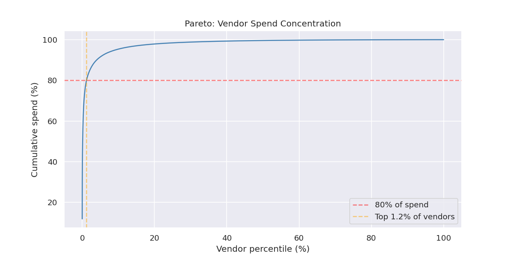

# Supply Chain Cost Intelligence

> **SQL-driven supplier analytics — the BOM cost analysis I've done manually in industrial manufacturing, rebuilt as a reproducible data system.**

[](https://www.python.org/)
[](https://duckdb.org/)
[](https://quarto.org/)
[](https://scikit-learn.org/)

Procurement teams lose millions annually to supplier inefficiencies hidden in their own data: price anomalies, unreliable lead times, and unoptimized vendor selection. This project surfaces those opportunities through SQL analysis and machine learning clustering — then delivers findings as an interactive Quarto analytical report.

**Built on real public data (USAspending.gov federal procurement)** — same problem structure as private-sector supplier intelligence, at real scale.

**Live report:** [aalias01.github.io/supply-chain-cost-intelligence](https://aalias01.github.io/supply-chain-cost-intelligence/)



---

## The Business Story

I've done this analysis manually — leading a BOM cost analysis for a major HVAC manufacturer: weeks of spreadsheet work tracing supplier re-sourcing opportunities and lead-time-driven safety stock. It worked, but it wasn't repeatable. This project is the version I wished I'd had — a reproducible, scalable data system:

- Vendor performance ranked by cost × lead time using SQL window functions
- Price anomalies surfaced with z-score analysis per category
- Suppliers segmented into actionable business tiers (not "Cluster 0")
- Cost reduction opportunities **quantified in dollars** — not just flagged

---

## Architecture

```
USAspending.gov federal procurement data
    ↓
scripts/fetch_data.py  — resolves current archive URL via API, stream-filters
                         the multi-GB zip to the analysis slice (stdlib only)
    ↓
DuckDB (analytical SQL engine — handles 10M+ rows locally)
    ↓
sql/01_vendor_performance.sql    — CTEs + RANK() + window functions
sql/02_price_anomalies.sql       — z-score anomaly detection per category
sql/03_cost_opportunities.sql    — "if-we-switched" cost reduction estimates
    ↓
notebooks/01_eda.ipynb           — Spend distribution, Pareto, concentration
notebooks/02_clustering.ipynb    — K-means supplier segmentation + elbow + silhouette
    ↓
report/supply_chain_intelligence.qmd → HTML   (primary deliverable)
```

---

## Tech Stack

| Layer | Tool | Notes |
|-------|------|-------|
| Database | DuckDB | In-process analytical SQL; handles the full USAspending slice |
| SQL analysis | CTEs, window functions, z-score, RANK | DATA 514 applied to real business problem |
| Python wrangling | Pandas | What SQL can't do cleanly |
| Clustering | scikit-learn K-means + Hierarchical | Named business segments, not cluster numbers |
| Visualization | Plotly (interactive), Seaborn | Plotly for cluster scatterplots in the Quarto report |
| Report | Quarto → HTML | Primary deliverable; deployed as static site |
| Hosting | GitHub Pages (static HTML via Actions) | |
| Environment | conda (`environment.yml`) | |

---

## Supplier Segments

K-means clustering groups vendors by: cost percentile · lead time · award frequency · spend concentration.

| Segment | Profile | Business recommendation |
|---------|---------|------------------------|
| **Premium Reliable** | Low cost, short lead time, consistent | Strategic partners — protect and deepen relationships |
| **Cost-Efficient** | Low cost, acceptable delivery | Preferred for commodity / non-critical awards |
| **Underperforming** | High cost or poor delivery | Candidates for replacement — quantified $ at stake |
| **Risky / Volatile** | Inconsistent performance | Flag for monitoring; escalation trigger |

*The interview story: "I deliberately named clusters with business recommendations, not 'Cluster 0.' Operations teams need output they can act on next Tuesday morning."*

---

## Key SQL Patterns

```sql
-- Vendor performance ranking with window functions (sql/01_vendor_performance.sql)
WITH vendor_metrics AS (
    SELECT
        recipient_name,
        naics_code,
        AVG(action_amount)  AS avg_award,
        COUNT(*)            AS award_count,
        SUM(action_amount)  AS lifetime_spend,
        AVG(DATEDIFF('day', action_date::DATE,
            period_of_performance_end::DATE)) AS avg_lead_time_days
    FROM federal_awards
    WHERE action_date >= '2023-01-01'
    GROUP BY recipient_name, naics_code
)
SELECT
    recipient_name,
    naics_code,
    avg_award,
    avg_lead_time_days,
    RANK() OVER (PARTITION BY naics_code ORDER BY avg_award ASC)           AS cost_rank,
    RANK() OVER (PARTITION BY naics_code ORDER BY avg_lead_time_days ASC)  AS speed_rank,
    SUM(lifetime_spend) OVER (PARTITION BY naics_code)                     AS naics_total_spend
FROM vendor_metrics
WHERE award_count >= 5;
```

## Key Results

All numbers produced by the reproducible pipeline (FY2023, manufacturing NAICS 33, 100K awards, $42.5B spend):

| Finding | Value | Notes |
|---------|-------|-------|
| Vendors analyzed | 11,257 (2,834 clustered) | Clustering requires ≥3 awards per vendor-NAICS pair |
| Price anomalies detected (\|z\| > 2) | 1,456 awards (1.5%) | Z-score per NAICS category |
| Actionable cost reduction opportunity | **$182M** | Scope-comparable substitution, 30% re-source rate |
| Raw price-gap screen | $8.6B | Upper bound — dominated by non-substitutable defense primes |
| Pareto concentration | Top **1.2%** of vendors = 80% of spend | Far steeper than the 80/20 rule |
| Optimal k / silhouette score | 4 / 0.271 | From `notebooks/02_clustering.ipynb` |

The $8.6B → $182M distinction is the point: the raw screen "re-sources" aircraft carriers to
machine shops. Filtering to scope-comparable substitutions (benchmark price within 10× of
current) is the judgment call that separates a screening query from a number you can defend
in front of a VP.

---

## Setup

```bash
# 1. Clone
git clone https://github.com/aalias01/supply-chain-cost-intelligence
cd supply-chain-cost-intelligence

# 2. Environment
conda env create -f environment.yml
conda activate supply-chain
python -m ipykernel install --user --name supply-chain --display-name "supply-chain"

# 3. Download data (USAspending.gov — free, no login required)
#    Stream-filters the ~2 GB archive to the analysis slice; stdlib only.
python3 scripts/fetch_data.py                 # FY2023, NAICS 33, 150K rows max

# 4. Load into DuckDB + save the committed sample
python -m src.data_loader --load --fy 2023 --naics 33 --limit 100000
python -m src.data_loader --sample --fy 2023

# 5. Run notebooks in order:
#    notebooks/01_eda.ipynb
#    notebooks/02_clustering.ipynb

# 6. Render Quarto report
quarto render report/supply_chain_intelligence.qmd
# Output: report/supply_chain_intelligence.html
# Pushing to main auto-deploys it to GitHub Pages (.github/workflows/pages.yml)
```

---

## Repository Structure

```
supply-chain-cost-intelligence/
├── README.md
├── .gitignore
├── environment.yml
├── requirements.txt
├── .github/workflows/pages.yml   ← Deploys the rendered report to GitHub Pages
│
├── scripts/
│   └── fetch_data.py  ← Archive URL discovery + streaming NAICS filter (stdlib only)
│
├── data/
│   ├── raw/           ← GITIGNORED — downloaded by scripts/fetch_data.py
│   ├── processed/     ← GITIGNORED — DuckDB tables
│   └── sample/        ← Small slice committed (~500 rows for reproducibility demo)
│
├── sql/
│   ├── 01_vendor_performance.sql   ← CTEs + RANK + window functions
│   ├── 02_price_anomalies.sql      ← Z-score price anomaly detection per category
│   └── 03_cost_opportunities.sql   ← "If-we-switched" quantified savings estimates
│
├── notebooks/
│   ├── 01_eda.ipynb          ← Spend distribution, Pareto, vendor concentration
│   └── 02_clustering.ipynb   ← K-means segmentation + elbow + silhouette + naming
│
├── src/
│   ├── data_loader.py    ← USAspending download, DuckDB load, schema setup
│   └── clustering.py     ← Vendor feature preparation + K-means + segment naming
│
├── report/
│   ├── supply_chain_intelligence.qmd   ← Quarto source (primary deliverable)
│   └── supply_chain_intelligence.html  ← Rendered output (gitignored except this)
│
└── figures/            ← Saved plots (committed)
```

---

## Design Decisions

1. **Manual analysis → data system.** This pipeline automates the kind of BOM cost analysis that usually lives in spreadsheets and takes weeks: the same analytical questions — where is spend concentrated, which suppliers are substitutable, what does lead time cost — answered reproducibly in minutes.

2. **SQL-first design.** The heavy lifting is deliberately in SQL, not Python. Procurement analysts live in SQL; CTEs and window functions are how the work actually gets done. The Python clustering sits on top of what SQL has already prepared — the realistic shape of a production deployment.

3. **Real data over synthetic.** USAspending.gov data is messy, at scale, and structurally identical to private-sector procurement. Cleaning and analyzing it is part of what the project demonstrates.

4. **Named segments, not cluster numbers.** The clustering output is framed as business recommendations — "switch 30% of Category X volume from Tier 3 to Tier 1 vendors; estimated annual savings $X" is something an operations team can act on.

---

*Built by [Alvin Alias](https://github.com/aalias01) — MS Data Science, University of Washington · 12 years engineering operations in industrial manufacturing, including BOM and procurement cost analysis*
